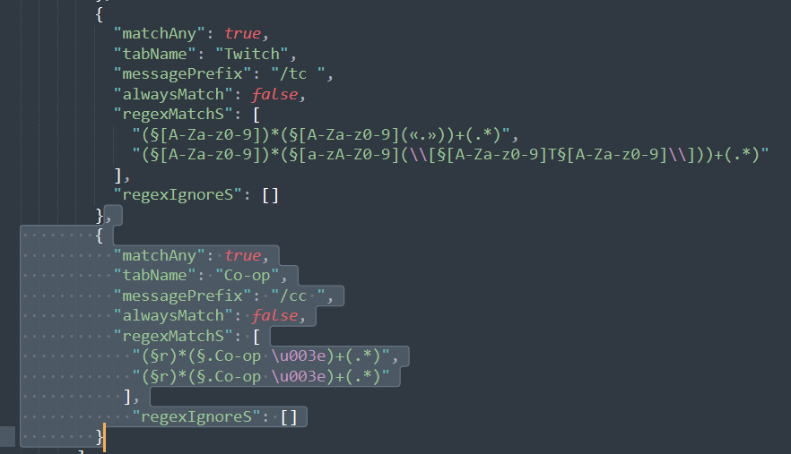

# Hychat Tabs

## Introduction
A collection of Hychat Regexes

**Use [Chatting](https://github.com/W-OVERFLOW/Chatting) from Wyvest, as of now Hychat is dead**

## Getting Started

### Requirements
* [Hychat](https://github.com/Moulberry/Hychat)
* Tyman's [Hychat](https://github.com/TymanWasTaken/Hychat)
* ThatGravyBoat's Hychat (private)

### Installation
To install a regex filter, find and copy a regex from the repository. <br>
<br> For Example <br>

```json
{
  "matchAny": true,
  "tabName": "Co-op",
  "messagePrefix": "/cc ",
  "alwaysMatch": false,
  "regexMatchS": [
    "(§r)*(§.Co-op \u003e)+(.*)",
    "(§r)*(§.CC \u003e)+(.*)"
  ],
  "regexIgnoreS": []
}
``` 
<br> Navigate to your hychat config folder, usually `%USERNAME%/.minecraft/config/hychat` <br>
<br>Edit `chat.json` and add the newly copied tabs at the bottom of the list just like so <br>

 <br>

Make sure your [json is formatted correctly](https://jsonformatter.curiousconcept.com/#) **OR ELSE** your config will **RESET**<br>

Save and boot up minecraft and it should be added to hychat.


