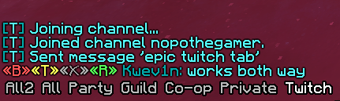
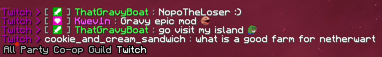

# Twitch Tab  

  
 Twitcher 

  
  Require [twitcher mod](https://www.curseforge.com/minecraft/mc-mods/twitcher) to use  
  
  

  

  
 ThatGravyBoat 

  
  Require ThatGravyBoat's Twitch Mod (private) to use
    
  Emotes from ThatGravyBoat's Hychat Mod (private)
  

